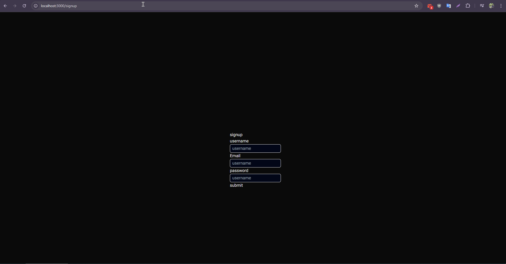
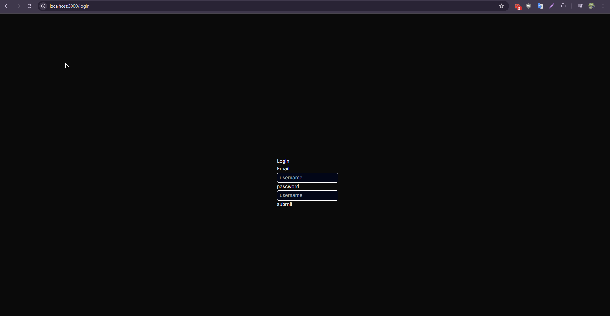
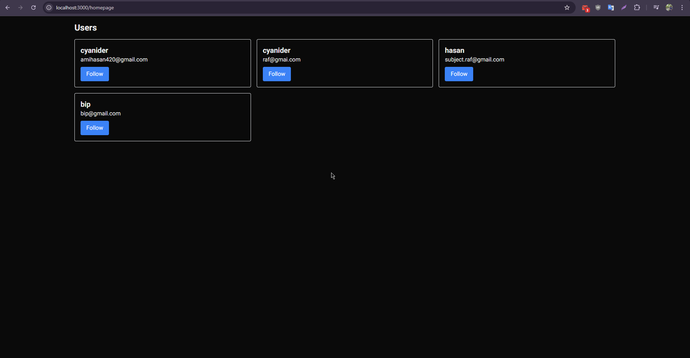
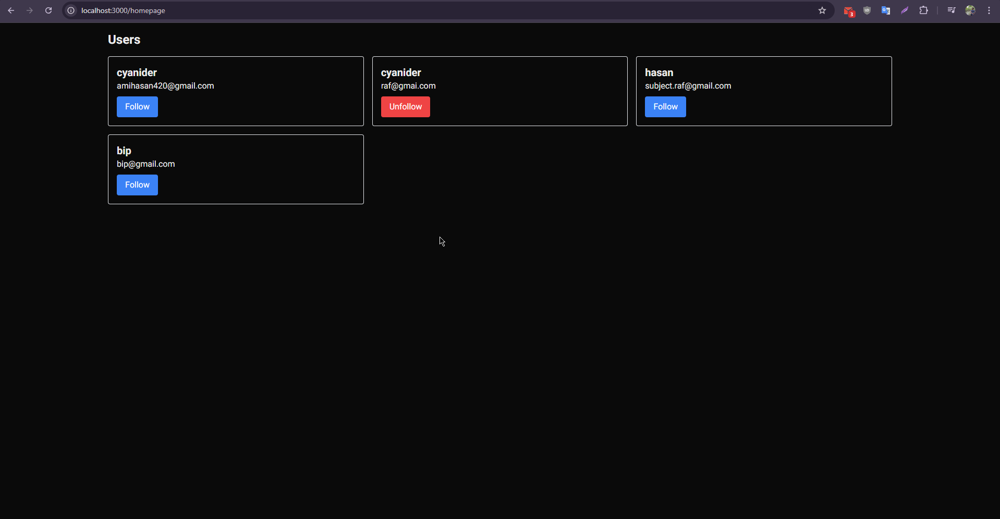

# Authentication and Follow System application

This project on creating a basic website with features such as user authentication and follow-unfollow toggle for users.

## Features Implemented

1. **Signup and Signin**

   - Users can register and log in to their accounts.
   - Upon successful signup, users receive a welcome email.

2. **Follow-unfollow**
   - A homepage that displays available users with a button to follow.

## Screenshots






## Tech Stack

- **Frontend**: Next.js
- **Backend**: Node
- **Database**: MySQL

## How to Run the Project

1. Clone this repository:

   ```bash
   git clone <repository-link>
   ```

2. Navigate to the project directory:

   ```bash
   cd project-directory
   ```

3. Install dependencies for the backend:

   ```bash
   npm install
   ```

4. Install dependencies for the frontend:

   ```bash
   npm install
   ```

5. Set up the database:

   - Run the XAMP Control Panel and Start Apache & MySQL Server.
   - Create a MySQL database naming twitter-clone.
   - run the following code in the phpmyadmin console

```
CREATE TABLE IF NOT EXISTS users
( id INT AUTO_INCREMENT PRIMARY KEY,username VARCHAR(100) NOT NULL,
  email VARCHAR(100) NOT NULL UNIQUE,
  password VARCHAR(255) NOT NULL,
  created_at TIMESTAMP DEFAULT CURRENT_TIMESTAMP
);
```

```
CREATE TABLE IF NOT EXISTS follows (
  follower_id INT NOT NULL,
  following_id INT NOT NULL,
  created_at TIMESTAMP DEFAULT CURRENT_TIMESTAMP,
  PRIMARY KEY (follower_id, following_id),
  FOREIGN KEY (follower_id) REFERENCES users(id) ON DELETE CASCADE,
  FOREIGN KEY (following_id) REFERENCES users(id) ON DELETE CASCADE
);
```

6. Start the backend server:

   ```bash
   nodemon
   ```

7. Start the frontend development server:

   ```bash
   npm run dev
   ```

8. Open the application in your browser at `http://localhost:3000`.

9. To visit homepage go to `http://localhost:3000/homepage`.

## Project Highlights

- **Authentication**: Secure user authentication with validation and email confirmation.
- **Follow-Unfollow**: A user can follow other users who are also signed in.
- **Scalable Codebase**: Modular and well-structured code for easier future enhancements.
